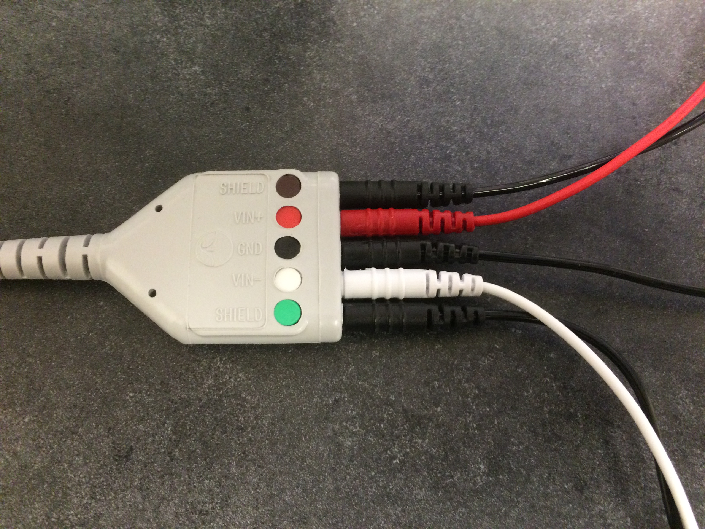
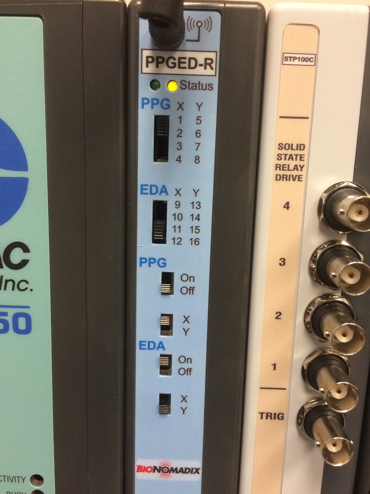
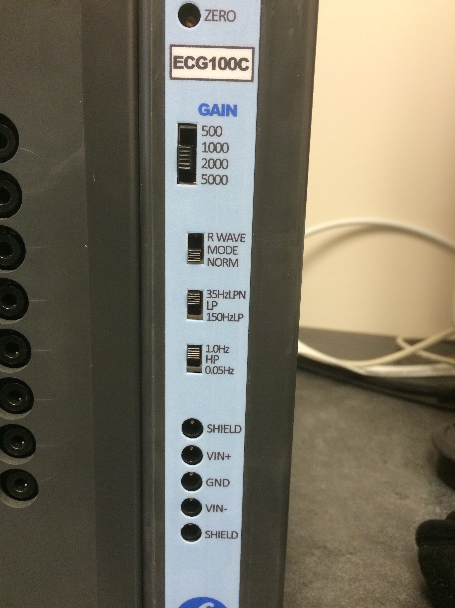
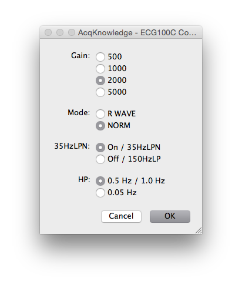
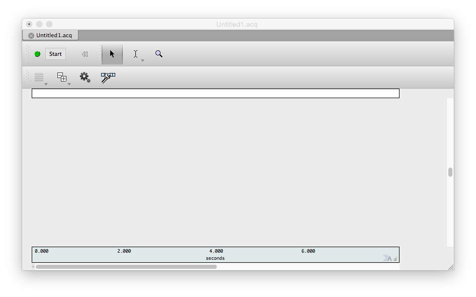
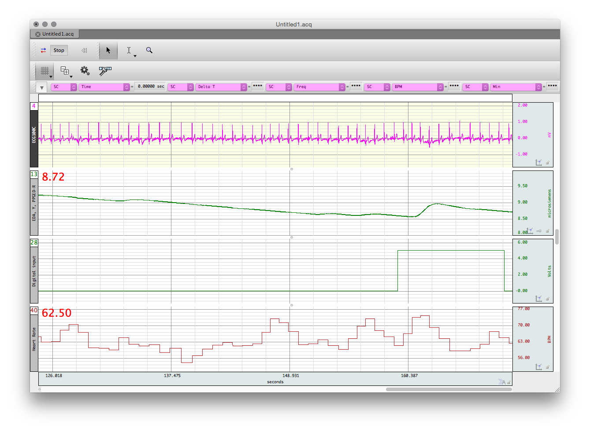

# SNaPP Lab BIOPAC Manual

Created 4 August 2015 by Edward Hernández  
Last modified 11 September 2015 by Edward Hernández  

Original version [Biopac How-To][Original] created 23 July 2013 by Drew Englehardt  
Based on [YouTube tutorials](https://www.youtube.com/user/BiopacSystems) created by BIOPAC Systems

## Setting up the Hardware

1. Connect the MP150, PPGED-R, STP-100C, UIM100C, and ECG100C units together, in that order. When completed, the units should look like this.  
  
If you want to collect data for multiple participants, include multiple copies of whatever units you need to collect that data.
2. Connect the MP150 unit to the slot 8 of the AT-FS708 with an ethernet cable. Connect the Acq*Knowledge* computer to slot 1 using another ethernet cable and an ethernet to USB adapter.  
In principle, the exact ports into which the cables are plugged should not matter, but this setup is what we have tested the most.  

3. Connect the leads for the EDA electrodes to the BioNomadix.  

4. Attach the ECG leads to the extension cord and the extension cord the ECG100C, exactly as pictured.  
  

5. Connect the DB-37 ribbon to the rear port of the STP-100C and the Stim**Tracker**, using the DB-37 to DB-25 adapter, as pictured.  
If this cable is already connected, do not tamper with it. Our adapter appears to be slightly misshapen, making connecting the ribbon extremely difficult.  
  
Connect the Stim**Tracker** to the SuperLab computer via the USB cord.  
5. For a single participant, set the switches as pictured. PPG is intentionally turned off, as ECG is a more direct, precise, and reliable measurement of the same phenomena.  
  
  
  
For multiple participants, ensure that no modules are set to use the same channels. If two modules are set to use the same channel, even if one of them is switched off, the data for that channel will be unusable.  
On the other hand, if you intend to turn off several modules (for example, multiple PPG modules in favor of ECG), you can conserve channels by setting all the unused modules to the same channel.
6. Turn on the MP150 and AT-FS708 units.

## Setting up Channels

If you have a graph template file for your project, open it now and skip to the next section. If not, this section will help you both to set up acquisition and create a template file.

1. Turn off the Wifi via the "Network" System Preferences tab.  
If the wifi is not turned off, the computer attempts to use the ethernet connection to access the network, making the hardware unusable. This is a known issue and will likely be patched in a future update.
2. Open Acq*Knowledge* 4.4.
3. If the following pop-up appears, try hitting retry. If it returns, test all connections, make sure the wifi is off, and restart the computer.  

4. Open a blank file (Acq*Knowledge* calls all its files "graphs"), by selecting `Create and/or Record a new experiment` and Create empty graph.  
  
You should now see a window that looks something like this.  
  
5. Select `ECG100C and ECG100C-MRI` from the list. For single participant collection, like the CIPI protocol, select channel 8.  
  
Proceed with the following settings.  
  
You should see something like this now.  

6. Set up a `PPGED-R` module the same way.  
set the radio buttons like this if you set your switches as pictured above. If you set them otherwise, make sure they match.  
  
Follow the instructions given by the following pop-ups.
    * At this first pop-up, make sure the BioNomadix unit is on.  
    
    * Make sure the leads are connected to the BioNomadix, but that they are not yet clipped to electrodes.  
    
    * Clip the leads to some electrodes, but do not attach them to a subject.  
    
7. To set up event marker acquisition from SuperLab, navigate to the `Digital` tab, and select `Acquire`, `Plot`, and `Value` for channel D8.  

8. To calculate heart rate from ECG in real time, navigate to the `Calculate` tab, and select `Acquire`, `Plot`, `Value`, and `Heart Rate (from ECG)` for Channel C0. This will calculate heart rate from the ECG data in real time.  
  

9. All of this setup and configuration can be saved in a template file. If you don't already have a template, use the `Save As...` dialogue to save the graph as a `.gtl` template.  

10. Close the `Data Acquisition Settings` menu.  You should see a blank graph.  

**Acq*Knowledge* is now ready to collect data!**

Be aware that there will be additional EDA calibration prompts at the start of data collection. These will be covered in the next section.

## Connecting a Subject to the Hardware

Before beginning to attach any equipment, have the participant remove all jewelry on their hands, arms, and ankles, and rinse their hands with water (do not have them wash with soap).  
For some protocols, you may wish to have the participant apply their own electrodes. If so, provide them with an [Electrode Placement Handout](Electrode_Handout.md) and connect the leads to the electrodes before they attach themselves.

1. Place a cloth [EL504](http://www.biopac.com/disposable-cloth-electrode-30) electrode on the inside surface of each of the participant's ankles, behind the bone, avoiding hair if possible.  
This placement should be ideal, avoiding both hair and fatty tissues.  

2. Place another cloth electrode on the inside surface of the participant's right forearm, approximately equidistant from the wrist and elbow, as pictured.  
  
For the cleanest data, the wrist would be ideal. However, left handed participants will have the BioNomadix unit covering the ideal area for most protocols, and inter-participant reliability and comparability of the ECG data is worth the small loss in quality.  
3. Connect the electrode on the forearm to the white lead, attaching the clip to the metal post on the electrode. Connect the red lead to the left ankle and the black lead to the right ankle.
4. Place foam [EL507](https://www.biopac.com/disposable-electrodermal-electrode-100-education) electrodes on the fingertips of the index and middle fingers of the participant's non-dominant hand, rubbing them in to ensure good contact.  

    * For the sake of precision, you may want to hold the electrode facing up and lower the participant's fingertip into the gel.
5. Wrap the BioNomadix unit's velcro strap around the wrist of the participant's non-dominant hand.  

    * For larger wrists, it may be useful to wrap one end of the strap around the plastic loop on one side of the BioNomadix, as pictured.  
    
    * For smaller wrists, it is generally better to thread the strap through both sides, and fasten one side of the strap to the other.  
    
6. connect the black lead to the electrode on the forefinger, and the red lead to the electrode on the middle finger.  

## Collecting Data in AcqKnowledge

This section assumes that you have already set up your channels exactly as described above, that you have the graph on which they are set up open already, and that your subject is connected to the equipment.

2. When you’re ready to begin data collection, press `Start`.
2. You should be presented with a pop-up instructing you to calibrate the BioNomadix EDA sensor. Follow the onscreen instructions:
    * You will be directed to attach the leads to the BioNomadix unit, but not to any electrodes. It is only *necessary* to have one lead detached. However, if it is better for your protocol, this can be done without the participant even present.
    * For the next calibration, you are asked to connect the leads to electrodes. This calibration should only be done when the electrodes are attached to the subject and you are prepared to begin recording data, as collection will begin immediately.
3. When you click `Calibrate`, collection will begin **immediately**, and you should see 4 channels separately gathering data in real time.
4. Collect data for about 30 seconds, the check to make sure the waveforms look essentially like this example.
    * This is what ideal data looks like:  
      
    * If your data doesn't look anything like this, try rescaling it using the autoscaling tools.
    * If the ECG graph looks strange, make sure the clips are properly fastened. If that doesn't help, just make a note in the lab log.
    * If the EDA graph looks rough like this, there is likely a connection problem between the electrodes and the fingertips. Rub them in to try to improve the connection.  
    
    * Note that the D8 channel should look completely flat unless you have a stimulus playing in SuperLab.  

#### Once you've established that your data collection looks good, you're ready to do science!

***

## Data Analysis using AcqKnowledge

#### \* **Currently this section is a duplication of Drew's older guide to analyzing EDA data. It will be renovated soon.** \*

1. To analyze EDA data, first filter any high frequency noise. Select Transform on the top menu, then filter, FIR, low pass. Define the filter with the following settings.
2. Select the `Locate SCRs` option in the `Electrodermal Activity` menu.
3. Choose to construct a new Tonic EDA channel from the Phasic EDA channel you collected.  
    * This should take some time, but when it is completed, the graph ought to look like this, with a new line and with events marked.
2. To count the number of EDA events, first create a copy of the EDA channel by going to Edit, then “Duplicate Waveform”.
3. Next, select the duplicate EDA waveform. Select transform, from the top menu, math functions, threshold. For the “lower threshold” input `0.05`, and for the “upper threshold” input `0.05`1. These settings will detect events that are 0.05 microsiemens or larger and will display the result as a series of spikes that meet the response criteria of being 0.05 microsiemens or larger. 
4. Then, go to `Analysis` and select `Find Rate`.  
Use the following criteria to count the number of peaks (i.e. EDA events) in the transformed waveform. Function: Find Rate. Threshold level: `0.05`.  
This creates a new waveform that is a count of the number of EDA events in the collected data. If you compare it to the waveform created in step 3, the count will increase by one at the end of each marked event.
5. AcqKnowledge also has an automated procedure to determine EDA events. To access it go to the Analysis tab, click on Electrodermal activity, and Locate SCRs.
6. Make sure the EDA channel is selected, and hit ok.
7. Finally, the EDA events are marked as below. The beginning and end of the SCR event are marked by ( and ) respectively. The peak event response is marked by a water droplet, like below.
