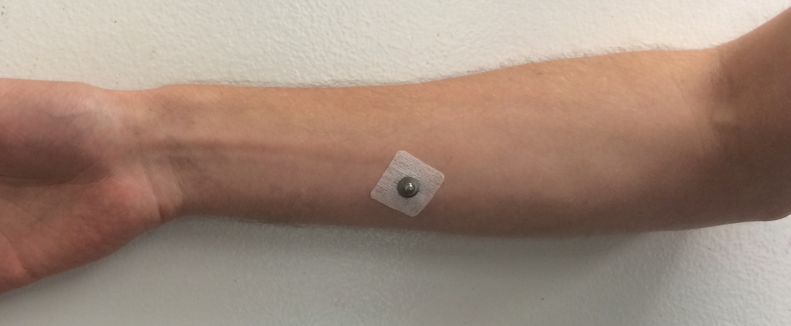
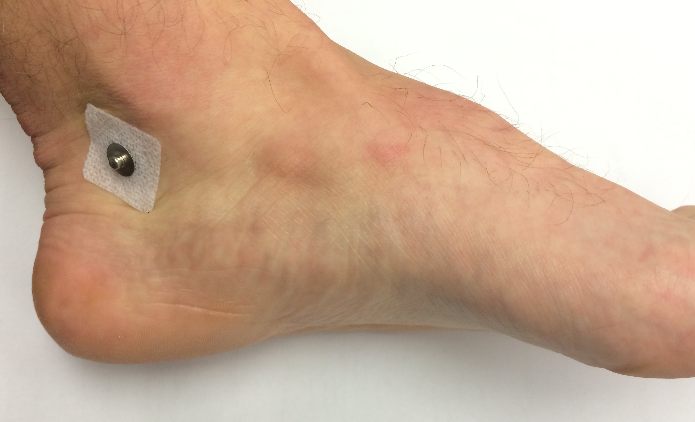

## Electrode Placement
### Right Arm

Place one electrode on the inner surface of your right forearm, equidistant from the wrist and elbow.

### Ankles

Place one electrode on the inner surface each of your ankles, behind the ankle bones. Avoid hair as possible.

